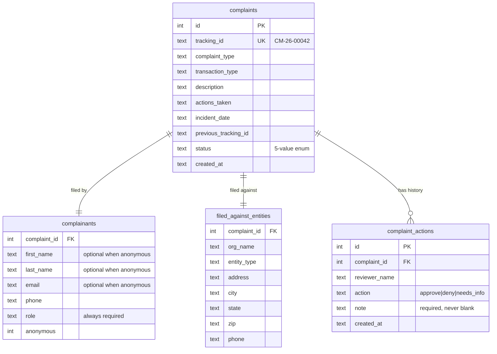

# ASETT — HIPAA Complaint Filing & Internal Review

A working implementation of the CMS **Administrative Simplification Enforcement and Testing Tool**
complaint workflow, built to a supplied design handoff (HTML prototype plus a written spec covering
the data model, endpoints, tokens, and per-screen behaviour).

Two flows:

1. **Guest complaint filing** — a public, no-account, seven-step wizard ending in a generated
   tracking ID (`CM-26-00042`). No draft saving, and no way to view the complaint afterwards.
2. **Internal intake review** — a reviewer signs in, works a queue, opens a complaint, and records
   a decision (Approve / Deny / Needs more info) with a mandatory note.

React + Vite on the front, Express + SQLite behind.

> **All data in this repository is synthetic.** No real complaints, people, organizations, or
> health information. See [Security posture](#security-posture) for what that means.

---

## Quick start

**Prerequisites:** Node.js 20+ (developed on 22.12). No database server to install — SQLite is
embedded.

```bash
npm run setup
```

```bash
npm run seed
```

```bash
npm run dev
```

Then open **http://localhost:5173**. The guest wizard is the front door; **Reviewer sign in** is in
the header.

**Reviewer credentials:** `reviewer` / `reviewer123`

### Other commands

| Command | What it does |
| --- | --- |
| `npm run setup` | Installs root, server, and client dependencies |
| `npm run dev` | Runs the API on `:3001` and Vite on `:5173`, which proxies `/api` |
| `npm test` | Backend test suite (25 tests) |
| `npm run seed` | Loads eight synthetic complaints across every status |
| `npm run seed:reset` | Wipes the database first, then re-seeds |
| `npm run build` | Builds the client into `client/dist` |
| `npm start` | Production mode — one process serving API **and** client on `:3001` |

To reset all state, run `npm run seed:reset`, or delete `server/db/asett.db` and re-seed.

### Walking the demo

1. Work through the wizard: complaint type → details → your information → filed-against entity →
   review → submit. Note the tracking ID on the confirmation screen.
2. Try **File anonymously** on the "Your information" step — name and email stop being required.
3. Sign in as the reviewer. The queue shows stat tiles, status filter chips, and every complaint.
4. Open a row. The decision panel stays disabled until you pick an action **and** write a note.
5. Record a decision — the status pill updates, the timeline gains an entry, and the queue reflects
   the new status.

---

## Project structure

```
server/
  index.js              Express app; serves the built client in production
  db/
    schema.sql          Table definitions — the source of truth for field names
    index.js            better-sqlite3 handle; runs the schema on boot
    seed.js             Synthetic demo data
  lib/
    referenceData.js    Picklists, statuses, decisions — one source for UI and validation
    validation.js       All field rules; returns a { 'section.field': message } map
    complaintStore.js   Every SQL statement and both write transactions
    trackingId.js       Atomic CM-YY-NNNNN generation
  routes/
    auth.js             Reviewer login/logout + requireReviewer middleware
    complaints.js       Submit, list, detail, record action
    reference.js        Serves reference data to the client
  test/api.test.js      25 tests over the route layer

client/src/
  api.js                The only place fetch is called
  auth.jsx              Reviewer session context + route guard
  reference.jsx         Fetches and shares reference data
  validation.js         Client mirror of the server rules (see note below)
  format.js             Date formatting — calendar dates vs. timestamps
  theme.css             Design tokens and components from the handoff
  components/           Chrome, Field primitives, ErrorSummary, StatusPill
  pages/
    guest/              GuestWizard, ProgressRail, ReviewSubmit, step bodies
    reviewer/           Login, Queue, Detail
```

Layering is deliberate: **routes do HTTP**, `lib/validation.js` holds business rules, and
`lib/complaintStore.js` owns SQL. The seed script and tests write through the same store the API
uses, so there is no parallel write path that can drift.

---

## Data model



`status` is one of `submitted`, `in_review`, `approved_for_intake`, `denied_for_intake`,
`needs_more_info`. A small `tracking_sequence` table (`year`, `last_seq`) backs ID generation.

### Why it is shaped this way

**Complainant and filed-against entity are separate tables, not columns on `complaints`.** They are
different entities with different meanings — the party filing versus the organization accused.
Flattening them would mean a dozen prefixed column pairs and no path to letting an entity exist
independently of one complaint.

**`complaint_actions` is append-only, and `complaints.status` is denormalized.** The queue is the
hottest read and needs a status for every row; deriving it from the newest action would mean a
correlated subquery or window function on every load. Storing it on the complaint makes that read
trivial. The cost is two places encoding one fact — which is safe **only** because the status
update and the action insert happen in a single transaction (`persistAction` in
`lib/complaintStore.js`). They cannot disagree.

**Actions are never updated or deleted.** A second decision appends a row. The log is the audit
trail; editing a past decision would destroy it.

**Anonymity is a disclosure control with a collection consequence.** Filing anonymously withholds
identity from the filed-against entity, and — per the handoff copy — CMS may be unable to
investigate without it. So name and email become optional while `role` stays required, and the
reviewer's detail screen shows "Withheld — filed anonymously" rather than blank fields.

**Tracking numbers come from a counter table, not `COUNT(*)`.** A count-derived sequence has two
bugs: two simultaneous submissions read the same count and collide on the `UNIQUE` index, and
deleting a complaint causes its number to be reissued. The counter is incremented with a single
atomic upsert inside the same transaction as the insert.

---

## API

All endpoints are under `/api`. Reviewer endpoints require `Authorization: Bearer <token>`.

| Method | Path | Auth | Purpose |
| --- | --- | --- | --- |
| `GET` | `/api/health` | — | Liveness probe |
| `GET` | `/api/reference` | — | Picklists, statuses, decision options |
| `POST` | `/api/complaints` | — | Submit a complaint; returns the tracking ID |
| `POST` | `/api/auth/login` | — | Reviewer sign in |
| `POST` | `/api/auth/logout` | reviewer | Invalidate the token |
| `GET` | `/api/complaints?status=` | reviewer | Queue rows + status counts for the tiles |
| `GET` | `/api/complaints/:id` | reviewer | Complaint, complainant, entity, and actions |
| `POST` | `/api/complaints/:id/actions` | reviewer | Record a decision |

Validation failures return `400` with a per-field map, keyed by section so the wizard can route
each message back to the step that owns it:

```json
{
  "errors": {
    "complaint.description": "A description of what happened is required.",
    "fae.orgName": "Organization name is required."
  }
}
```

---

## Notes on the design implementation

**Fonts are self-hosted** through `@fontsource` (latin subsets only) rather than loaded from the
Google Fonts CDN the handoff suggests. A government-facing page that pulls fonts from a third party
leaks every visitor's IP address to that third party. Same typefaces, no external request, works
offline.

**The shell scales on wide viewports.** The handoff fixes every size in px against a 1140px
container, which on a 1080p-or-larger display leaves a small column of small text surrounded by
empty page. Rather than diverging from the specified type scale, the whole shell is zoomed in steps
from 1200px upward, so every proportion stays exactly as designed and the page grows with the
screen.

**Calendar dates are never passed through a timezone.** `incident_date` is a plain date, not an
instant; parsing `2026-05-14` with `new Date` yields UTC midnight, which renders as May 13 for any
viewer west of Greenwich. `format.js` keeps the two cases apart — `formatDay` splits the string,
`formatStamp` converts genuine UTC timestamps to local time.

**Rail steps only navigate backwards.** The prototype lets you jump to any step as a demo
convenience; its own notes say to gate forward navigation on validation in production, so completed
steps are clickable and future ones are not.

**A sign-in screen sits before the queue.** The prototype jumps straight from "Reviewer sign in" to
the queue, but the handoff's state notes call for a real gate, so there is one — a single hardcoded
account, as specified.

**States list.** The prototype's state control offers only NY/CA/TX, which reads as placeholder
content rather than intent. This ships the full 50 states + DC; address fields are optional either
way, so it only affects what a filer may pick.

### Deliberately out of scope

| Cut | Why |
| --- | --- |
| **Supporting document upload** | Called out as out of scope in the handoff itself. Doing it properly needs object storage, presigned URLs, MIME allowlisting, size caps, and AV scanning; doing it badly is the most dangerous thing in an app like this. |
| **Registered accounts, drafts, post-submit tracking** | The handoff specifies guest filing with no draft saving and no retrieval endpoint. |
| **Pagination on the queue** | Correct at demo scale, wrong at 50,000 rows. |
| **Notifications** | `needs_info` is explicitly an internal hold with nothing sent to the complainant, and there is no notification subsystem for anything else to leak into. |

### The one intentional duplication

`server/lib/validation.js` and `client/src/validation.js` encode overlapping rules. The server copy
is authoritative and protects the database; the client copy exists so a filer learns about a bad ZIP
without a round trip. They return identically-keyed error maps, so a disagreement degrades
gracefully — the server wins and its message lands on the right field. At a larger size these would
be one shared schema (Zod) consumed by both sides.

---

## Security posture

**This is not a HIPAA-regulated system, and does not need to be.** It processes no PHI — a complaint
records who is complaining and about whom, not patient data — there is no Business Associate
Agreement, and every record is synthetic.

### Built

- **Parameterized queries everywhere.** Every statement is prepared once with bound parameters; no
  SQL string is assembled from request data. Injection is structurally impossible rather than a rule
  someone has to remember.
- **No PII in logs.** The error handler logs method, path, and message — never request bodies.
- **Server-authoritative validation**, including picklist membership, so a tampered client cannot
  write a value the dropdown never offered.
- **Request body cap** (1 MB) so an unauthenticated JSON endpoint is not a memory-exhaustion target.
- **Bearer tokens in a header, not cookies** — CSRF is not applicable by construction.

### Deliberately *not* built

| Not built | What production would need |
| --- | --- |
| **Real reviewer auth** | One hardcoded account, random in-memory token, no expiry. Production: argon2id hashes, a sessions table so tokens survive restarts and can be revoked, idle + absolute timeouts, login rate limiting, MFA. |
| **Encryption at rest** | The SQLite file is plaintext. Production: encrypted volume or a managed database with TDE. |
| **Audit logging of reads** | Decisions are recorded, but *views* are not. A real system logs who read which complainant's contact details and when — especially for anonymous filings. |
| **Rate limiting** | Nothing throttles the public submit endpoint or the login form. |
| **Transport security** | Plain HTTP locally; production terminates TLS at the reverse proxy. |

---

## Accessibility

Section 508 conformance is a baseline requirement for CMS-facing work, so the patterns are built in
rather than deferred:

- **Error-summary pattern** — a failed step moves focus to a summary listing every problem, each
  entry linking to the field that caused it. Inline messages alone are never announced to a
  keyboard or screen-reader user who is rejected on submit.
- **Focus management** — focus moves to the step heading on every wizard transition, and to the
  status pill after a decision is recorded.
- **Semantic structure** — the progress rail is an ordered list with `aria-current="step"`; radio
  cards are real `fieldset`/`legend` with real radio inputs styled over; queue rows are `<button>`
  elements, so the whole row is keyboard-operable.
- **Field wiring** — labels bound with `htmlFor`, plus `aria-required`, `aria-invalid`, and
  `aria-describedby` pointing at hint, counter, and error text.
- **Colour is never the only signal** — status pills always carry their status as text.
- **Visible focus ring on everything** (2px `#1a4480`, 2px offset), a skip link as the first tab
  stop, and 44px minimum touch targets on buttons.

Not done: a formal audit with a screen reader or automated tooling (axe, Lighthouse).

---

## Deployment

Production runs as a **single Node process**. If `client/dist` exists, Express serves it and falls
back to `index.html` for client-side routes, so there is no separate static host.

```bash
npm run setup && npm run build
```

```bash
NODE_ENV=production PORT=3001 npm start
```

Reverse-proxy `:3001` behind nginx or Caddy with TLS, and run it under `systemd` or `pm2`.
`NODE_ENV=production` disables CORS, since the client is then same-origin.

Reviewer tokens live in process memory, so a redeploy signs the reviewer out; the client handles
that by clearing the token on a 401 and returning to sign-in. Complaints are on disk — back up
`server/db/asett.db`.

---

## Testing

```bash
npm test
```

25 tests on Node's built-in runner against an in-memory database — no test framework dependency.
They cover submission validation (future dates, impossible calendar dates, forged picklist values,
malformed tracking IDs), the anonymity branch in both directions, tracking-ID sequencing, username
normalization, the auth guards on every protected endpoint, status filtering and counts, and the
decision workflow including action→status mapping and that a second decision appends rather than
replaces.

Not covered: frontend component tests. Both flows were verified by driving the running production
build in a browser.
