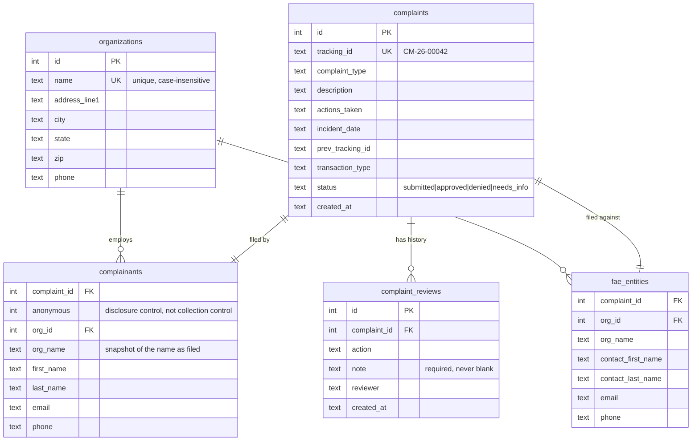

# ASETT — HIPAA Complaint Filing & Internal Review

A working prototype of the CMS **Administrative Simplification Enforcement and Testing Tool**
complaint workflow, rebuilt as a React + Express + SQLite application.

It implements two flows:

1. **Guest complaint filing** — a public, no-account, seven-step wizard gated by email
   verification, ending in a generated complaint reference number (`CM-26-00042`).
2. **Internal review** — a reviewer signs in, works a queue of submitted complaints, opens one,
   and records an intake decision (Approve / Deny / Needs More Info) with a mandatory note.

Modelled on the behaviour of the CMS sandbox at
`asett--asettdev.sandbox.my.site.com/complaints`.

> **All data in this repository is synthetic.** No real complaints, people, organizations, or
> health information are included. See [Security posture](#security-posture) for what that means
> and what a production deployment would need.

---

## Quick start

**Prerequisites:** Node.js 20+ (developed on 22.12). No database server to install — SQLite is
embedded.

```bash
npm run setup
```

```bash
npm run seed
```

```bash
npm run dev
```

Then open **http://localhost:5173**.

`npm run dev` starts two processes: the API on `:3001` and the Vite dev server on `:5173`, which
proxies `/api` to the API so the browser only ever talks to one origin.

**Reviewer credentials:** `reviewer` / `reviewer123`

### Other commands

| Command | What it does |
| --- | --- |
| `npm run setup` | Installs root, server, and client dependencies |
| `npm run dev` | Runs API + Vite dev server together |
| `npm test` | Runs the backend test suite (31 tests) |
| `npm run seed` | Loads four synthetic complaints across all four statuses, plus their organizations |
| `npm run seed:reset` | Wipes the database first, then re-seeds |
| `npm run build` | Builds the client into `client/dist` |
| `npm start` | Production mode — one process serving API **and** the built client on `:3001` |

To reset all state, run `npm run seed:reset`, or delete `server/db/asett.db` (plus its `-wal` /
`-shm` sidecars) and re-seed.

### Walking the demo

1. From the landing page, choose **File a Non-Compliance Allegation → Continue as Guest User**.
2. Enter any email address. **No mail is actually sent** — the six-digit code is displayed in a
   yellow "Demo mode" box and printed to the API console.
3. Complete the wizard. On the Complainant and FAE steps, type into the **Organization** field to
   search existing records (try `riv` or `card`), or use **+ New Organization** to create one —
   selecting an organization fills in and locks the address fields beneath it.
4. Note the `CM-YY-NNNNN` reference number on the confirmation screen.
5. Sign in as the reviewer, find that complaint in the queue, open it, and record a decision with
   a note.
6. Return to the queue — the status badge has changed, and the detail page now shows the action in
   its review history.

---

## Project structure

```
server/
  index.js              Express app; serves the built client in production
  db/
    schema.sql          Table definitions — the source of truth for field names
    index.js            better-sqlite3 handle; runs the schema on boot
    seed.js             Synthetic demo data
  lib/
    validation.js       All field rules; returns a { 'section.field': message } map
    complaintStore.js   Complaint SQL and both write transactions
    organizationStore.js Organization search and create
    trackingId.js       Atomic CM-YY-NNNNN generation
    verification.js     Mocked email OTP (hashed, expiring, attempt-capped)
    referenceData.js    Picklists — the single source for both UI and validation
  routes/
    auth.js             Reviewer login/logout + requireReviewer middleware
    complaints.js       Submit, list, detail, review
    organizations.js    Organization lookup + inline creation
    reference.js        Serves the picklists to the client
    verification.js     OTP request/verify
  test/api.test.js      31 tests over the route layer

client/src/
  api.js                The only place fetch is called
  auth.jsx              Reviewer session context + route guard
  validation.js         Client mirror of the server rules (see note below)
  theme.css             CMS-inspired design tokens and components
  components/           Stepper, Field primitives, ErrorSummary, Modal, StatusBadge,
                        OrganizationPicker (ARIA combobox + create modal)
  pages/
    Home.jsx            Landing + "File a Complaint" and verification dialogs
    guest/              GuestWizard + seven step components
    reviewer/           Login, ComplaintList, ComplaintDetail
```

Layering is deliberate: **routes do HTTP**, `lib/validation.js` holds business rules, and
`lib/complaintStore.js` owns SQL. The seed script and tests write through the same store the API
uses, so there is no parallel write path that can drift.

---

## Data model



There is also a small `tracking_sequence` table (`year`, `last_seq`) backing reference-number
generation — see below.

### Why it is shaped this way

**Organizations are shared records, referenced by both parties.** An organization named as an FAE
in one complaint is findable when the next filer names the same one, which is the whole point of
the lookup. Two consequences worth noting. First, the **address lives on the organization**, not on
the person — which is why selecting one fills in and locks the complainant's address fields, and
why the address is required when creating an organization but optional on the complaint itself.
Second, `complainants` and `fae_entities` keep **both** `org_id` and `org_name`: the FK links to
the canonical record, and the name is a snapshot of what was filed, so a complaint still reads
correctly if the organization is later renamed.

Dedupe is on name alone, case-insensitively, which is a simplification — real organizations share
names across cities. The natural key would include the address or, more fittingly for this domain,
the NPI or EIN, which are themselves among the identifiers ASETT exists to enforce.

**Complainant and FAE are separate tables, not columns on `complaints`.** They are different
entities with different meanings — one is the person filing, the other is the organization being
accused. Flattening them into one row would mean a dozen `complainant_*` / `fae_*` column pairs
and no way to later let an FAE exist independently of a single complaint.

**`complaint_reviews` is append-only history, and `complaints.status` is denormalized.** The queue
is the most frequent read in the app, and it needs a status for every row; deriving that from the
latest review would mean a correlated subquery or window function on every list load. Storing it
on the complaint makes that read trivial. The cost is that two places now encode the same fact —
which is safe **only** because the status update and the history insert happen inside a single
transaction (`persistReview` in `lib/complaintStore.js`). They cannot disagree.

**Reviews are never updated or deleted.** A second decision on the same complaint appends a new
row. The history is the audit trail; changing a past decision would destroy it.

**Tracking numbers come from a counter table, not `COUNT(*)`.** The first implementation derived
the sequence from a row count, which had two bugs: two simultaneous submissions read the same
count and collided on the `UNIQUE` index, and deleting a complaint caused its number to be issued
again. The counter is now incremented with a single atomic upsert inside the same transaction as
the insert, so concurrent submits get distinct numbers and sequences never go backwards.

---

## API

All endpoints are under `/api`. Reviewer endpoints require `Authorization: Bearer <token>`.

| Method | Path | Auth | Purpose |
| --- | --- | --- | --- |
| `GET` | `/api/health` | — | Liveness probe |
| `GET` | `/api/reference` | — | Picklists for the UI |
| `GET` | `/api/organizations?q=` | — | Search organizations by name |
| `POST` | `/api/organizations` | — | Create one inline; returns the existing record on a name collision |
| `POST` | `/api/verification/request` | — | Issue a 6-digit code for an email |
| `POST` | `/api/verification/verify` | — | Exchange a code for a verification token |
| `POST` | `/api/complaints` | verification token | Submit a complaint |
| `POST` | `/api/auth/login` | — | Reviewer sign in |
| `POST` | `/api/auth/logout` | reviewer | Invalidate the token |
| `GET` | `/api/complaints` | reviewer | Queue, optional `?status=` |
| `GET` | `/api/complaints/:id` | reviewer | Full record + review history |
| `POST` | `/api/complaints/:id/reviews` | reviewer | Record a decision |

Validation failures return `400` with a per-field map, keyed by section so the wizard can route
each message back to the step that owns it:

```json
{
  "errors": {
    "complaint.description": "Complaint description is required.",
    "complainant.email": "Enter a valid email address."
  }
}
```

---

## Scoping decisions

The assignment asked for a faithful-enough replica, not a clone. Everything below was cut
deliberately, with the reasoning recorded rather than left as a silent gap.

| Cut | Why |
| --- | --- |
| **Supporting document upload** | Doing it *properly* means object storage, presigned URLs, MIME allowlisting, size caps, and virus scanning. Doing it improperly is worse than not doing it, since an unauthenticated upload endpoint is the single most dangerous thing in an app like this. |
| **Registered accounts, drafts, view-after-submit** | The brief specified guest filing with no draft saving and no post-submission tracking. Adding accounts would have meant real password storage and session management. Sketched out in `INTERVIEW-PREP.md`. |
| **Full Salesforce picklists** | Five transaction types, five organization types, and six states, versus hundreds. Enough to demonstrate that the server validates against its own list rather than trusting the client. |
| **Duplicate MI / cell-phone fields** | Present in the original form; they add form length without adding behaviour. |
| **Email/SMS notifications** | No mail server. The OTP delivery function is isolated to one place (`deliverCode` in `lib/verification.js`) so swapping in SES or SendGrid is a one-function change. |
| **Pagination on the queue** | Correct at demo scale, wrong at 50,000 rows. Called out as a known limitation rather than pretended away. |
| **Organization *merge* and admin curation** | Organizations can be searched and created, but not merged, edited, or deactivated. Inline creation by guests means near-duplicates will accumulate; a real system needs staff tooling to reconcile them. |

### The one intentional duplication

`server/lib/validation.js` and `client/src/validation.js` encode overlapping rules. The server copy
is authoritative and protects the database; the client copy exists so a user learns about a bad ZIP
code without a round trip. They return identically-keyed error maps, so if they ever disagree the
server simply wins and its message lands on the right field. At a larger size these would be one
shared schema (Zod / JSON Schema) consumed by both sides — at this size, a second small pure module
is cheaper than the build plumbing sharing would require.

---

## Security posture

**This prototype is not a HIPAA-compliant system, and does not need to be.** It processes no PHI —
a complaint records who is complaining and about whom, not patient data — there is no Business
Associate Agreement, and every record is synthetic. Building encryption-at-rest and audit
infrastructure here would be theatre.

What that means concretely:

### Built

- **Parameterized queries everywhere.** Every statement is prepared once with bound parameters; no
  SQL string is ever assembled from request data. Injection is structurally impossible rather than
  a rule someone has to remember.
- **No PII in logs.** The error handler logs method, path, and message — never request bodies. The
  OTP module refuses to log the code or address when `NODE_ENV=production`.
- **Server-authoritative validation**, including picklist membership, so a tampered client cannot
  write a value the dropdown never offered.
- **Request body cap** (1 MB) so an unauthenticated JSON endpoint is not a memory-exhaustion target.
- **OTP hygiene**: codes are stored as SHA-256 hashes, single-use, expiring, capped at five
  attempts, resend-throttled, and compared in constant time. The verification token is bound to the
  email address it proved, so a filer cannot verify one address and file under another.
- **Bearer tokens in a header, not cookies** — which means CSRF is not applicable by construction.
- **`LIKE` wildcards escaped in organization search**, so a user typing `%` searches for a literal
  percent sign instead of matching every row. Covered by a test.

### Deliberately *not* built, and why

| Not built | What production would need |
| --- | --- |
| **Real reviewer auth** | One hardcoded account, random in-memory token, no expiry. Production: hashed credentials (argon2id), a sessions table so tokens survive restarts and can be revoked, idle + absolute timeouts, login rate limiting, and MFA. |
| **Encryption at rest** | SQLite file is plaintext. Production: encrypted volume or a managed database with TDE, plus key management. |
| **Audit logging** | Reviewer decisions are recorded, but *reads* are not. A real system logs who viewed which complainant's PII and when. |
| **Rate limiting** | Only the OTP resend is throttled. Production: per-IP limits on login, on the public submit endpoint, and on organization search/create — the last two are unauthenticated and write to the database. |
| **Transport security** | Plain HTTP locally. Production terminates TLS at the reverse proxy and sets HSTS. |
| **Secrets management** | Credentials are in source because they are fake. Production: environment or a secrets manager, never the repo. |

### A note on anonymity

The wizard's "Do you want to remain anonymous?" question is a **disclosure control, not a
collection control**. In ASETT it means *CMS will not share your identity with the Filed-Against
Entity during the investigation* — and even that is qualified by FOIA. It does not mean the
complaint is submitted anonymously: contact details stay required, and the guest flow verifies the
email address before filing.

That distinction drives the implementation. The flag changes **who may see** the complainant, not
what is stored, so the enforcement point belongs at the disclosure boundary. This prototype has no
FAE-facing surface, so the honest implementation is to store the flag and show the reviewer a
prominent do-not-disclose banner. If an FAE portal were added, the flag would be enforced in a
serialization layer that structurally omits complainant identity — not in a template, where the
next person to add a screen can forget it.

---

## Accessibility

Section 508 conformance is a baseline requirement for CMS-facing work, so the patterns are built in
rather than deferred:

- **Error-summary pattern** — a failed step moves focus to a summary listing every problem, each
  entry linking to the field that caused it. Inline messages alone are never announced to a
  keyboard or screen-reader user who is rejected on submit.
- **Focus management** — focus moves to the step heading on every wizard transition, into and back
  out of modals, and to the status badge after a decision is recorded.
- **Semantic structure** — the stepper is an ordered list with `aria-current="step"`; radio groups
  are `fieldset`/`legend`; tables have scoped headers and captions.
- **Field wiring** — labels bound with `htmlFor`, plus `aria-required`, `aria-invalid`, and
  `aria-describedby` pointing at hint and error text.
- **Colour is never the only signal** — status badges always carry their status as text, and error
  fields get a thick left border alongside the red.
- **A visible focus ring on everything**, and a skip link as the first tab stop.

Not done: a full audit with a screen reader or automated tooling (axe, Lighthouse). The patterns
are right; they have not been formally verified.

---

## Deployment (VPS)

Production runs as a **single Node process**. If `client/dist` exists, the Express server serves it
and falls back to `index.html` for client-side routes, so there is no separate static host to
configure.

```bash
npm run setup && npm run build
```

```bash
NODE_ENV=production PORT=3001 npm start
```

Then reverse-proxy `:3001` behind nginx or Caddy with TLS. Run it under `systemd` or `pm2` so it
restarts on boot. Two things to know:

- **`NODE_ENV=production` matters.** It disables CORS, stops the OTP code from being returned in
  the API response or written to the log, and is what makes the demo affordances disappear.
- **In-memory state is lost on restart.** Reviewer tokens, pending OTP codes, and verification
  tokens live in process memory, so a redeploy signs the reviewer out and invalidates verification
  mid-flight. Both cases are handled rather than left to fail: the reviewer is returned to the
  login screen, and a guest whose verification died is offered a new code **in place**, keeping
  everything they had already entered. Complaints themselves are on disk and survive — back up
  `server/db/asett.db`.

---

## Testing

```bash
npm test
```

31 tests using Node's built-in runner against an in-memory database — no test framework
dependency. They cover OTP issuance, expiry, replay, and lockout; submission validation including
future dates and forged picklist values; verification-token binding, and that a rejected
submission writes nothing and can be retried without duplicating; tracking-ID sequencing;
organization creation, case-insensitive dedupe, and `LIKE`-wildcard escaping; the auth guards on
every protected endpoint, plus username normalization; and the review workflow, including that a
second decision appends to history rather than replacing it.

Not covered: frontend component tests and browser-level end-to-end tests. The React layer was
verified manually and via a scripted pass over the running production build.

---

## Further reading

**[ARCHITECTURE.md](ARCHITECTURE.md)** — a request traced end-to-end through every file, the
reasoning behind each decision, the accessibility mechanics, a ranked list of this
implementation's weak points, and what production would need.
